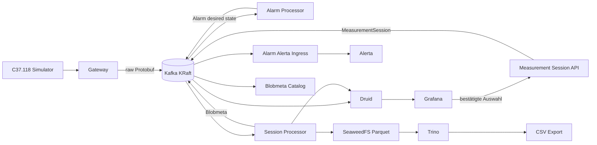

```{meta}
:description: Kurzer Einstieg in den WAMA Docker-Compose PoC für Softwarearchitektinnen und Softwarearchitekten.
```

# WAMA PoC: Einstieg in zehn Minuten

Diese Seite ist der kurze Rundgang für neue Softwarearchitektinnen und
Softwarearchitekten. Der Ablauf beginnt bei den PMUs und folgt einem Wert durch
das System: **PMU → Gateway → Kafka → Anzeige und Verarbeitung**. Danach zeigt
die Seite zuerst das Alarmsystem, dann Measurement Sessions, Alerta und den
GitOps-Weg für neue Prozessoren.

Der PoC läuft lokal mit Docker Compose. Er ist eine technische
Demonstrationsumgebung, kein Produktionsbetrieb mit Kubernetes.

## 1. Voraussetzungen

Installiert sein müssen:

- Docker Engine
- Docker Compose v2 oder neuer


Es gibt zwei getrennte Repositories:

- `~/infra` enthält die WAMA-Infrastruktur und die Benutzeroberflächen.
- `~/c37-118-simulator` enthält die simulierte PMU-Quelle.

## 2. Starten

Zuerst die Infrastruktur starten:

```sh
cd ~/infra
docker compose up -d --build
docker compose ps --all
```

Danach den C37.118-Simulator separat starten:

```sh
cd ~/c37-118-simulator
docker compose up -d --build
```

Der Simulator ist eine Quelle für C37.118-Telegramme. Er schreibt nicht selbst
nach Kafka und kennt weder Druid noch Grafana. Die Gateway-Demonstration
verbindet ihn mit der Infrastruktur. Nach dem Start können Provisionierung und
Gateway-Workflow einige Sekunden benötigen.

## 3. Vom PMU-Wert zur Anzeige

Die PMUs senden C37.118-Telegramme an das Gateway. Das Gateway nimmt die
Telegramme an, ordnet Signale und Quellen zu und veröffentlicht die normalisierten
Werte in Kafka. Kafka ist damit der zentrale Datenbus: Dort können wir im Kafka
UI sehen, ob Werte tatsächlich angekommen sind.

Von Kafka gehen die Werte in mehrere Richtungen:

- Druid speichert die Live-Messwerte für Zeitreihenabfragen.
- Grafana zeigt die Messwerte und erzeugt daraus die Operatoransicht.
- Prozessoren berechnen abgeleitete Werte, zum Beispiel Frequenz-Skalierungen,
  Leistungen oder Alarme.
- Ein IEC-104-Export kann ausgewählte, verarbeitete Werte an ein
  Kontrollzentrum weitergeben.

## 4. Die wichtigsten Fenster

| Was | URL |
| --- | --- |
| PMU Control Console | <http://localhost:8081> |
| Alerta | <http://localhost:18081> |
| Grafana | <http://localhost:3001> |
| WAMA Measurements Dashboard | <http://localhost:3001/d/wama-measurement-sessions/wama-measurement-sessions> |
| Kafka UI | <http://localhost:8080> |
| Druid | <http://localhost:8888> |
| Measurement-Session-Anfrage | <http://localhost:3004> |
| Measurement-Session CSV-Export | <http://localhost:3005> |
| IEC-104-Live-Monitor | <http://localhost:3003> |
| Mailpit | <http://localhost:8025> |

Die PMU Control Console gehört zum Simulator. Die übrigen Oberflächen gehören
zur Infrastruktur. Für Zugriffe aus dem LAN wird statt `localhost` die IP des
Docker-Hosts verwendet, sofern der jeweilige Dienst laut README öffentlich
gebunden ist.

## 5. Kurzer Rundgang

### Live-Daten ansehen

1. Öffne die PMU Control Console.
2. Prüfe, dass die simulierte Quelle läuft und Messwerte sendet.
3. Öffne Grafana und das Dashboard **WAMA Measurements**.
4. Wähle einen Zeitraum, in dem neue Messwerte eintreffen.
5. Öffne bei Bedarf Kafka UI und prüfe das Topic `LiveMeasurement`.

Nach erfolgreicher Gateway-Provisionierung erscheinen gültige PMU-Werte in
Druid und anschließend im Grafana-Dashboard. Die typische Wartezeit liegt im
Bereich weniger Sekunden; der genaue Zeitpunkt hängt vom Startzustand der
Container und vom Gateway-Workflow ab.


### Alarm über die Controller Console auslösen

Die **PMU Control Console** ist der sichtbare Einstieg in die Demo. Sie steuert
nicht die Infrastruktur, sondern stellt kontrollierte Szenarien für die
simulierte PMU bereit.

1. Öffne die [PMU Control Console](http://localhost:8081).
2. Gib ein nichtleeres Operator-Label ein.
3. Wähle bei der gewünschten PMU ein Szenario wie **Signal excursion** aus.
4. Starte die Aktion über den Button und bestätige sie ausdrücklich.
5. Beobachte anschließend die veränderten Live-Werte in Grafana und bei Bedarf
  im Kafka UI im Topic `LiveMeasurement`.

Eine **Signal excursion** ist dabei zunächst ein simuliertes Eingangssignal:
Die PMU liefert für eine begrenzte Zeit einen Wert außerhalb des normalen
Verlaufs. Erst ein konfigurierter Alarm-Processor bewertet diese Abweichung als
fachlichen Alarm. Die Console erzeugt also nicht selbst den Alarm in Alerta.

### Das Alarmsystem verstehen

Der Alarm-Processor liest qualifizierte Live-Messwerte, prüft die konfigurierte
Regel und veröffentlicht bei einer Überschreitung einen gewünschten Alarmzustand
im kompaktierten Kafka-Topic `Alarm`. Bleibt die Bedingung bestehen, wird der
aktuelle Alarmzustand aktualisiert; fällt sie weg, veröffentlicht der Processor
eine passende Löschung (Tombstone).

So bleiben Messwert und Alarm getrennt: `LiveMeasurement` enthält die Messung,
`Alarm` den aktuellen fachlichen Zustand der Regel. Eine historische
Measurement Session ist ebenfalls kein Alarm.

### Measurement Session erzeugen

Eine Measurement Session ist eine begrenzte historische Abfrage. Sie enthält
Startzeit, Endzeit und eine sortierte Liste von MRIDs.

1. Öffne das WAMA Measurements Dashboard in Grafana.
2. Wähle einen kurzen Zeitraum und die gewünschten MRIDs.
3. Öffne die Aktion für die Measurement Session.
4. Bestätige die Anfrage im lokalen Measurement-Session-Portal.
5. Warte, bis die Session als abgeschlossen oder teilweise abgeschlossen
  erscheint.
6. Öffne den erzeugten Link oder lade die ausgewählten Werte als CSV herunter.

Der lokale API-Dienst auf Port `3004` veröffentlicht nur die bestätigte Anfrage
im Kafka-Topic `MeasurementSession`. Er liest keine Messwerte. Die eigentliche
Verarbeitung liest das Zeitfenster aus Druid, schreibt ein unveränderliches
Parquet-Artefakt nach SeaweedFS und veröffentlicht danach `Blobmeta`.

Der vollständige Ende-zu-Ende-Check lautet:

```sh
cd ~/infra
scripts/test-measurement-session-flow.sh
```

### Alerta ansehen

Alerta ist im PoC die Bedienoberfläche für Incidents. Es ist nicht Grafana und
auch kein Ersatz für die Live-Messwertansicht.

Ein Alarm entsteht über den Alarm-Processor und wird als aktueller, kompaktierter
raw-Protobuf-Zustand im Kafka-Topic `Alarm` veröffentlicht. Der Dienst
`alarm-alerta-ingress` gleicht diesen Zustand mit Alerta ab. Öffne danach die
Alerta-Oberfläche und prüfe den zugehörigen WAMA-Incident.

Der fokussierte Alarm-Pfad kann reproduzierbar geprüft werden mit:

```sh
cd ~/infra
scripts/test-alerta-alarm-flow.sh
```

Der Test verwendet standardmäßig eine eigene, vergängliche Compose-Umgebung.
Er verändert den laufenden Root-Stack nicht.

Alerta ist dabei die Incident-Oberfläche für den Operator. Der Dienst
`alarm-alerta-ingress` liest das `Alarm`-Topic und gleicht nur WAMA-eigene
Alarme mit Alerta ab. Dort kann ein Operator einen Incident anerkennen und
schließen. Eine Benachrichtigung geht im lokalen PoC zusätzlich an Mailpit.

### IEC-104-Export und Sekundenmittelwerte

Für den Exportpfad kann ein Processor gültige Frequenzwerte je MRID in
UTC-Sekunden sammeln und daraus einen arithmetischen Mittelwert bilden. Dieser
Wert wird als typisierter `Export`-Datensatz veröffentlicht. Der root-owned
IEC-104-Exporter wandelt ihn anschließend in das unterstützte IEC-104-ASDU um
und sendet ihn an genau ein Kontrollzentrum.

Das ist im PoC ein bewusst begrenzter Exportpfad. Die vollständige fachliche
LFR-Vorzugsfrequenzlogik ist davon zu unterscheiden und bleibt ein eigener,
komplexerer Processor.

## 6. Prozessoren einfach ändern: GitOps

Konfiguration und Prozessorlogik liegen versioniert in Git. Forgejo Actions
prüfen einen Pull Request mit Tests und bauen das Processor-Image. Erst eine
freigegebene Änderung auf `main` darf den zugehörigen Processor aktualisieren.
Der Processor deployt nur seinen eigenen Anwendungsdienst; die Root-
Infrastruktur und das Gateway bleiben außerhalb seiner Zuständigkeit.

Für normale elektrotechnische Aufgaben soll die Änderung möglichst nah an der
Fachsprache bleiben:

1. Eingänge, Einheiten und Ausgänge auswählen.
2. Eine Formel, Schwelle oder ein Zeitfenster konfigurieren.
3. Beispiele mit erwarteten Ergebnissen hinterlegen.
4. Pull Request prüfen und nach erfolgreicher Pipeline freigeben.

Eine einfache Regel wie `S = U × I`, eine Einheitenumrechnung, ein Grenzwert
oder ein Sekundenmittelwert sollte so lesbar sein wie eine technische
Arbeitsanweisung. Die Plattform übernimmt dabei Kafka, Protobuf, Validierung,
Build und Deployment.

Das ist die Richtung der geplanten Standard-Authoring-Schicht, nicht bereits
ein vollständig implementierter No-Code-Editor. Die aktuelle technische
Beschreibung steht in [WAMA processor authoring experience](../explanation/wama-processor-authoring.md).

Für komplexe Aufgaben bleibt der vollständige Entwicklungsweg offen. Ein
Processor kann eigenes Python, Tests und geprüfte Bibliotheken verwenden, wenn
er Zustandsverwaltung, Event-Time, verspätete Werte, Wiederanlauf, externe
Schnittstellen oder einen speziellen Datenvertrag benötigt. 

## 7. Was technisch passiert



### Live-Messwerte

Der C37.118-Simulator liefert Telegramme an das Gateway. Das Gateway wandelt
die Quelle in den WAMA-Datenvertrag um und veröffentlicht raw-Protobuf
`LiveMeasurement`-Datensätze auf Kafka. Druid konsumiert diese Datensätze
direkt und stellt sie ohne Rollup für Zeitreihenabfragen bereit. Grafana fragt
Druid für das WAMA-Messwert-Dashboard ab.

### Alarme

Alarme sind kein Nebenprodukt jeder einzelnen Grafikabfrage. Ein Processor
bewertet Messwerte oder Regeln und veröffentlicht den aktuellen gewünschten
Alarmzustand im kompaktierten Topic `Alarm`. Der Ingress liest diesen Zustand,
ordnet ihn einem WAMA-Incident zu und synchronisiert ihn nach Alerta.
Tombstones schließen nur den zugehörigen, von WAMA verwalteten Incident.

### Measurement Sessions

Die Session ist absichtlich ein eigener Datenfluss:

1. Grafana liefert eine vom Benutzer bestätigte Auswahl an die lokale API.
2. Die API validiert sie und veröffentlicht `MeasurementSession` auf Kafka.
3. Der Processor liest die historische Messwertspanne aus Druid.
4. Er erstellt ein unveränderliches Parquet-Artefakt in SeaweedFS.
5. `Blobmeta` beschreibt Status, Hash, Zeilenzahl und MRID-Abdeckung.
6. PostgreSQL materialisiert nur diese Metadaten.
7. Der Query-Indexer registriert geprüfte Artefakte in Trino.
8. Das Session-Portal beziehungsweise der CSV-Exporter liest über Trino.

Kafka bleibt die Quelle der Wahrheit für die Ereignisse und Metadaten. Die
Messwerte selbst bleiben in Druid beziehungsweise im unveränderlichen
Session-Artefakt; sie werden nicht in PostgreSQL oder VictoriaMetrics kopiert.

## 8. Wenn etwas nicht sichtbar ist

Prüfe zuerst den Infrastrukturstatus:

```sh
cd ~/infra
docker compose ps --all
docker compose logs --tail=100 infra-readiness
docker compose logs --tail=100 gateway-dashboard-provisioner
```

Für den Simulator:

```sh
cd ~/c37-118-simulator
docker compose ps
docker compose logs --tail=100
```

Die vollständige technische Beschreibung steht in [WAMA platform overview and
processes](../explanation/wama-platform-overview.md), [WAMA architecture and
technology choices](../explanation/wama-architecture.md) und [WAMA data flow
and contracts](../reference/wama-data-flow-contracts.md).
